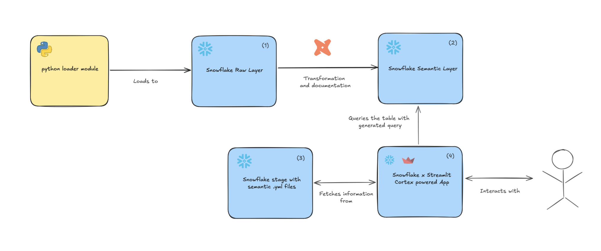

[](http://commitizen.github.io/cz-cli/) 

  


# **DBT-Snowflake-Cortex**

The purpose of this repository is to demonstrate the use of Cortex Analyst on a demo dbt project with Snowflake. The project generates mock data with Python, loads it into Snowflake, prepares/documents the data with [**dbt-core**](https://docs.getdbt.com/docs/core/about-core-setup), and sets up a Streamlit application with Cortex Analyst to generate insights with natural language.

## Table of Contents
- [Prerequisites](#prerequisites)
- [Project Description](#project-description)
- [Setup Instructions](#setup-instructions)
- [Usage Instructions](#usage-instructions)
- [Contribution Guidelines](#contribution-guidelines)
- [License](#license)
- [Contact](#contact)

## Prerequisites

To run the project:
- Have a Snowflake account (trial or paid)
- Set up your Snowflake account credentials for dbt in `~/.dbt/profiles.yml`
- Set up your Snowflake account credentials for the `snowflake-cli` at `~/.snowflake/config.toml`

## Project Description



The project is divided into the following sections:

### 1. Snowflake Raw Layer
See the [`./snowflake_setup/`](./snowflake_setup/) directory.

### 2. DBT-prepared Semantic Layer
See the dbt app in the [`./dbt_app/`](./dbt_app/) directory.

### 3. Cortex Snowflake Semantic Layer
Check the file in `streamlit_app/dbt_app.yml` (Generated by hand ATM).

### 4. Streamlit App for Text-to-SQL with Cortex Analyst
The code can be found in the [`./streamlit_app/`](./streamlit_app/) folder.

## Setup Instructions

### Snowflake Setup
1. Create a Snowflake account (trial or paid)
2. Set up your Snowflake account credentials for dbt in `~/.dbt/profiles.yml`:

    ```yaml
    cortex-profile:
      outputs:
        dev:
          account: <ACCOUNT>
          database: DBT_CORTEX
          password: <PWD>
          role: ACCOUNTADMIN
          schema: PUBLIC
          type: snowflake
          user: <USER>
          warehouse: COMPUTE_WH
      target: dev
    ```
3. Set up your Snowflake account credentials for the `snowflake-cli` at `~/.snowflake/config.toml`:
    ```toml
    [connections.DEMO_CORTEX_ACCOUNT_ADMIN]
    account = "<ACCOUNT>"
    user = "<USER>"
    password = "<PWD>"
    role = "ACCOUNTADMIN"
    warehouse = "COMPUTE_WH"
    database = "DBT_CORTEX"
    schema = "PUBLIC"
    ```

### DBT Setup
1. Install dbt:
    ```sh
    pip install dbt
    ```
2. Initialize the dbt project:
    ```sh
    dbt init
    ```

## Usage Instructions

1. Generate mock data with Python:
    ```sh
    python loader
    ```
2. Load data into Snowflake
   ```sh
    python
   ```
2. Load data into Snowflake:
    ```sh
    cd dbt_app
    dbt run
    ```

## Contribution Guidelines

We welcome contributions! Please follow these steps:
1. Fork the repository.
2. Create a new branch (`git checkout -b feature-branch`).
3. Make your changes.
4. Commit your changes (`git commit -m 'Add new feature'`).
5. Push to the branch (`git push origin feature-branch`).
6. Open a pull request.

## License

This project is licensed under the MIT License. See the [MIT LICENSE](LICENSE.md) file for details.

## Contact

For questions or support, please contact [GuillaumeGSicara](mailto:guillaume.gonde@sicara.com).